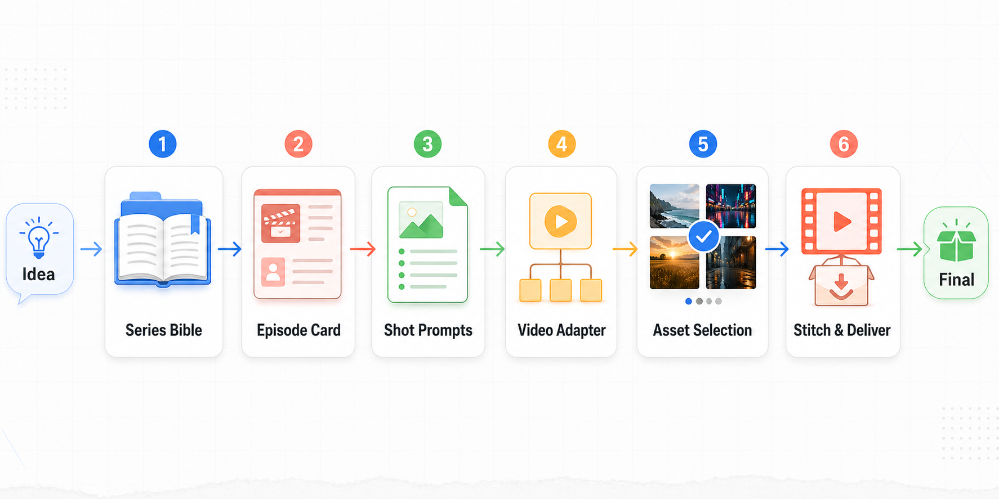

# Plotloom

**AI 短剧生产 CLI | Agent-neutral Skills | Repo-first 工作流**

Plotloom 是一套面向短剧生产的 CLI + Skills 工具箱。它不把创作过程藏进数据库、仪表盘或队列里，而是把每一步都落成可读、可提交、可复盘的系列仓库文件：`series.md`、`characters.md`、`video-prompts.md`、候选素材、`selected.mp4` 和最终交付物。

## 核心组合

| 环节 | 默认能力 |
|------|----------|
| 系列设定 | Plotloom skills 生成剧集设定、角色设定和 episode card |
| 图片素材 | 本机 Codex image generation 能力，适合角色图、场景图、封面图 |
| 视频生成 | Dreamina/即梦 CLI、VolcEngine Seedance 2.0、mock adapter |
| 选择与交付 | 候选版本管理、`selected.*` 固化、ffmpeg/ffprobe 拼接检查 |

> Plotloom 的重点不是“一键黑盒生成”，而是让 Agent 和人类可以围绕同一个 repo 协作，把短剧生产过程拆成清晰、可审查、可重跑的文件边界。

## 概述


Plotloom 不是把一个想法直接丢给模型、等待黑盒产出成片。它把短剧生产拆成一条可审查的 repo-first 链路：先沉淀系列设定、角色关系和视觉锚点，再围绕单集生成图片与视频候选；人或 Agent 逐步选择、重跑、修 prompt，最后只把确认过的素材拼成交付物。

这条链路里的每一步都有明确文件边界：

- `series.md` / `characters.md`：系列长期记忆和角色一致性锚点。
- `episode-card.md`：单集 hook、反转、情绪目标和 cliffhanger。
- `video-prompts.md` / `video-prompts-en.md`：可提交给 Dreamina、Seedance 等模型的 clip 任务。
- `candidates/`：模型生成的多版本图片或视频素材。
- `selected.*`：经过 review 后被接受的版本。
- `final.mp4`：由 selected clips 拼接出的最终交付视频。

## 推荐客户端

| 客户端 | 状态 |
|--------|------|
| Codex | 已适配 CLI + skills 协作方式 |
| Claude Code | 可通过 skills 安装使用 |
| 其他支持 skills.sh 的客户端 | 按各自的 skills 安装方式接入 |

Plotloom 的核心约束是 agent-neutral：CLI 不绑定某一个 Agent，skills 也尽量用文件契约而不是隐藏状态传递上下文。

## 安装 CLI

### 方式一：uvx（推荐，无需安装）

```bash
uvx plotloom --help
```

### 方式二：pip（全局安装）

```bash
pip install plotloom
plotloom --help
```

### 方式三：本地开发模式

```bash
git clone https://github.com/T0UGH/plotloom.git
cd plotloom
pip install -e .
plotloom --help
```

如需运行开发测试：

```bash
uv sync --extra dev
uv run pytest
```

## 安装 Skills

Plotloom skills 推荐通过 `skills` CLI 安装：

```bash
npx skills add T0UGH/plotloom --all
```

常用变体：

```bash
# 项目级安装，交互选择 Agent
npx skills add T0UGH/plotloom

# 全局安装到支持的 Agent
npx skills add T0UGH/plotloom --global --all

# 只安装一个 skill
npx skills add T0UGH/plotloom --skill plotloom-shot-prompts --all

# 只查看可安装的 skills
npx skills add T0UGH/plotloom --list
```

本地开发时可以从仓库根目录安装：

```bash
npx skills add . --list
npx skills add . --all
```

## 快速开始

```bash
# 1. 初始化本机配置
plotloom config init

# 2. 创建一个短剧系列 repo
plotloom init neon-heiress --title "霓虹假千金"

# 3. 进入默认创建位置
cd ~/plotloom_repo/neon-heiress

# 4. 补一段可测试的 prompt
cat > episodes/ep001/video-prompts-en.md <<'EOF'
## Clip 01

Prompt string:
A 5-second vertical short-drama opening. A young heiress walks into a neon-lit hotel lobby, calm but dangerous.
EOF

# 5. 本地 mock 生成候选视频，不调用真实 provider
plotloom --repo . video submit --episode ep001 --clip clip-01 --adapter mock

# 6. 选择候选版本
plotloom --repo . select episodes/ep001/videos/clip-01/candidates/v001.mock.mp4

# 7. 检查 repo 状态
plotloom --repo . validate --require-prompts --require-media
```

生成后的关键文件：

```text
episodes/ep001/video-prompts-en.md
episodes/ep001/videos/clip-01/candidates/v001.mock.mp4
episodes/ep001/videos/clip-01/selected.mp4
episodes/ep001/videos/clip-01/tasks/mock-local.toml
```

## 通过 Skills 创作

Plotloom 的推荐用法是让 Agent 按阶段调用 skills，而不是一次性完成所有步骤。先用 series/episode/prompt skills 把创作意图收敛成稳定文件，再用 adapter/selection/delivery skills 生产、审查和交付素材。



推荐顺序：

```text
1. plotloom-series-bible      -> 稳定系列设定、角色关系和视觉锚点
2. plotloom-episode-card      -> 定义单集 hook、反转、cliffhanger
3. plotloom-shot-prompts      -> 生成连续视频 prompt
4. plotloom-video-adapter     -> 提交 mock / Dreamina / Seedance 候选视频
5. plotloom-asset-selection   -> accept、reroll 或 revise_prompt
6. plotloom-stitch-deliver    -> 拼接 selected clips 并准备交付
```

### Skills 清单

| Skill | 说明 |
|-------|------|
| `plotloom-series-bible` | 创建或更新 `series.md`、`characters.md` 和角色素材 brief |
| `plotloom-episode-card` | 为单集生成轻量 episode intent card |
| `plotloom-shot-prompts` | 生成适合 Seedance/Dreamina 的连续视频 prompt |
| `plotloom-video-adapter` | 提交或轮询 mock、Dreamina、VolcEngine 视频任务 |
| `plotloom-asset-selection` | 审查候选素材并固化为 `selected.*` |
| `plotloom-stitch-deliver` | 用本地媒体工具拼接 `final.mp4` 并整理交付文件 |

## 支持的 Provider

| Adapter | 类型 | 用途 | 备注 |
|---------|------|------|------|
| `mock` | 本地视频 | 本地 E2E、测试和演示 | 不调用真实 provider |
| `codex-app-server` | 图片 | 角色、场景、封面、reference 图 | 依赖本机 Codex 和 image generation 能力 |
| `dreamina-cli` | 视频 | Dreamina/即梦视频生成 | 依赖本机 Dreamina CLI 登录态 |
| `volcengine-seedance` | 视频 | VolcEngine Ark Seedance 2.0 | 通过 Ark async task API 提交和轮询 |

真实 provider 建议先跑 doctor，再做单条短 clip smoke：

```bash
plotloom doctor --adapter dreamina-cli --deep
plotloom doctor --adapter volcengine-seedance --deep
plotloom config doctor --adapter volcengine-seedance
```

更多 smoke 步骤见 [Plotloom Provider Smoke Runbook](docs/runbooks/plotloom-provider-smoke.md)。

## CLI 命令

| 命令 | 说明 |
|------|------|
| `plotloom init` | 初始化一个系列 repo |
| `plotloom validate` | 检查系列 repo 的必要文件和媒体状态 |
| `plotloom config` | 管理 `~/.plotloom/.env.toml` 配置 |
| `plotloom repos` | 管理本机系列 repo registry |
| `plotloom prompt` | 检查、提取、编译 episode prompt |
| `plotloom image` | 生成并归档图片候选 |
| `plotloom video` | 提交和轮询视频生成任务 |
| `plotloom asset` | 导入和查看本地素材 |
| `plotloom select` | 把候选素材复制为 `selected.*` |
| `plotloom media` | 调用本地媒体工具 probe、check、normalize |
| `plotloom stitch` | 规划或拼接 selected clips |
| `plotloom delivery` | 汇总交付文件 |
| `plotloom doctor` | 检查本机 adapter、依赖和配置状态 |

查看完整参数：

```bash
plotloom --help
plotloom video submit --help
plotloom image generate --help
```

## 配置

Plotloom 默认配置文件是：

```text
~/.plotloom/.env.toml
```

初始化：

```bash
plotloom config init
plotloom config path
```

默认模板会包含：

```toml
[plotloom]
repos_root = "~/plotloom_repo"
registry_path = "~/plotloom.toml"
default_image_adapter = "codex-app-server"
default_video_adapters = ["dreamina-cli", "volcengine-seedance"]

[adapters.codex-app-server]
enabled = true
codex_binary = "codex"
app_server_url = ""

[adapters.dreamina-cli]
enabled = true
binary = "dreamina"
home = "~"

[adapters.volcengine-seedance]
enabled = true
ark_api_key = ""
base_url = "https://ark.cn-beijing.volces.com/api/v3"
model = "doubao-seedance-2-0-260128"
default_resolution = "720p"
```

### 环境变量覆盖

| 环境变量 | 配置项 |
|----------|--------|
| `PLOTLOOM_CONFIG` | 指定配置文件路径 |
| `PLOTLOOM_REPOS_ROOT` | 覆盖默认系列 repo 根目录 |
| `PLOTLOOM_REGISTRY_PATH` | 覆盖 registry 路径 |
| `CODEX_BINARY` | 覆盖 Codex binary |
| `CODEX_APP_SERVER_URL` | 覆盖 Codex app server URL |
| `DREAMINA_BINARY` | 覆盖 Dreamina CLI binary |
| `DREAMINA_HOME` | 覆盖 Dreamina home |
| `ARK_API_KEY` | VolcEngine Ark API Key |
| `PLOTLOOM_VOLCENGINE_BASE_URL` | 覆盖 VolcEngine base URL |
| `PLOTLOOM_VOLCENGINE_MODEL` | 覆盖 Seedance model |

配置优先级：

```text
环境变量 > ~/.plotloom/.env.toml > 内置默认值
```

Plotloom 的 doctor 只报告密钥是否存在，不会输出密钥内容。

## 系列 Repo 结构

```text
series.md
characters.md
plotloom.toml
assets/
  cast/
  scenes/
episodes/
  ep001/
    episode-card.md
    video-prompts.md
    video-prompts-en.md
    images/
    videos/
      clip-01/
        candidates/
        tasks/
        selected.mp4
outputs/
```

这个结构是 Plotloom 的主要状态边界：Agent 可以读写它，人类可以 review 它，Git 可以记录它。

## 设计边界

Plotloom 当前不做这些事：

- 不内置数据库
- 不维护隐藏 workflow state
- 不提供 dashboard
- 不运行后台队列 worker
- 不默认批量消耗真实 provider 额度
- 不把 Feishu/Lark 当作状态中心
- 不强制生成完整剧本、分镜表或导演阐述

MVP 的原则是 prompt-first、repo-first、adapter-thin。

## 开发

```bash
# 安装开发依赖
uv sync --extra dev

# 运行测试
uv run pytest

# 构建并检查包
rm -rf dist build plotloom.egg-info
uv run --isolated --with build --with twine python -m build
uv run --isolated --with twine twine check dist/*
```

发布新版本前需要先 bump `pyproject.toml` 里的版本号；PyPI 不允许覆盖已经发布的同名版本。

## Tagline

Weave short dramas from sparks.
